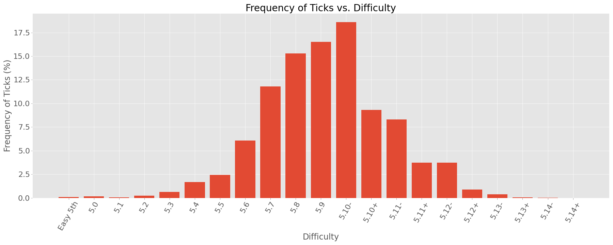
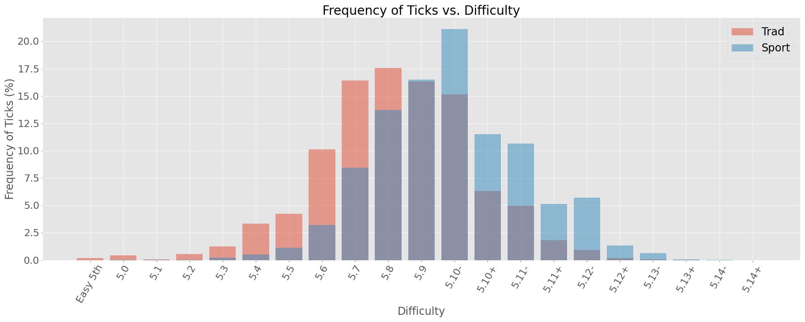
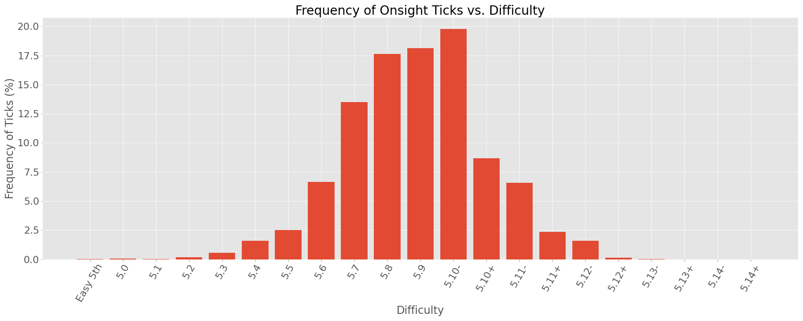
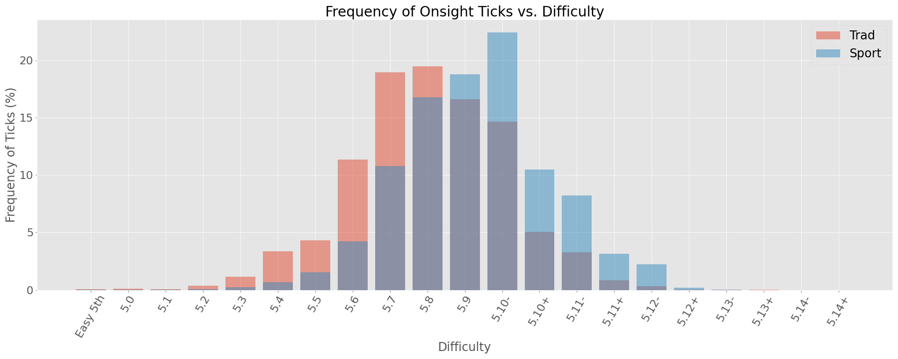

# Mountain Project Scraper

## Motivation
Data is a great way to gain insight into many things. The goal of this project is to use data sourced from the climbing
community to gain insights into the distributions of route completions, to-dos and average onsight/flash/redpoint
grades.

## The Data
I webscraped ~99% of the data contained on MountainProject area, route, and statistics pages. Unfortunately, since
comments are not loaded on a page until you scroll down to them, I was not able to obtain them via a simple requests
call. Instead, I used Selenium to scroll down on the page, wait for the comments to load, and then extract the HTML.
From the scraped HTML I extracted the content I was interested in. This includes:

* ~58k areas
  
* ~52k area comments

* ~250k routes

* ~315k route comments

* ~2.7M explicit route ratings

* ~5.5M route completions

* ~4.6M route to-dos

These features are extracted from the raw HTML and are dumped into JSON files.

From the JSON files, I populate a PostgreSQL database so that the data can be easily accessed.

## Statistical Analysis

### Overall Tick Distributions
The first thing I looked at after persisting the data to my database was the distribution of route ticks as a function
of difficulty. The overall distribution as well as overlayed distributions for trad and sport can be seen below.

Examining these distributions we find the following statistics:

| |         Sport  |         Trad  |
|---|----------|--------|
| Mean |  5.10b  |  5.9-   |
|Std. Dev| ~8.3 grades | ~9.4 grades |

Note that the numeric grade values given for the standard deviation represent a grade difference. That is, the
difference between 5.10a and 5.10- is 1 grade. 5.9+ and 5.9- is 2, and so on.

I will make a null hypothesis that the mean sport tick is 6 grades higher than the mean trad tick, and an alternate
hypothesis that the mean sport tick is more than 6 grades higher than the mean trad tick.

Choosing an alpha of 0.01, and using the above statistics, I will run a one-sided t-test. With a p-value of ~0, I can
confidently say that the mean sport tick is more than 6 grades greater than the mean sport tick.

Climber's reading this may be wondering why 6 grades when looking at the above statistics, and the answer lies within
MountainProject's grading scale:

| Difficulty |
|------------|
|5.8+|
|5.9-|
|5.9|
|5.9+|
|5.10a|
|5.10-|
|5.10a/b|
|5.10b|
|5.10|
|5.10b/c|
|5.10c|
|5.10+|
|5.10c/d|
|5.10d|
|5.11a|

Now the difference of 6 grades makes more sense.

### Onsight Tick Distributions
Next I wanted to examine the onsight distributions of routes by grade. The overall distribution as well as the overlayed
distributions for sport and trad are seen below:

Examining these distributions as before, we find the following statistics:

| |         Sport  |         Trad  |
|---|----------|--------|
| Mean |  5.10a  |  5.8+   |
|Std. Dev| ~7.8 grades | ~7.0 grades |

We take our null hypothesis that the mean onsight difficulty for sport routes is 4 grades higher than that of trad
routes. The alternative hypothesis is then that the mean onsight difficulty for sport routes is greater than 4 grades
higher than the mean onsight difficulty for trad routes.

Choosing an alpha value of 0.01, I again run a one-sided t-test and determine that with a p-value of ~0, I can reject
the null hypothesis and say that the difference between mean onsight difficulty of sport and trad routes is greater than
4 grades.

## Conclusions
I scraped MountainProject for data concerning routes, route ticks, areas, comments, to-dos, and ratings. The scraped
data accounts for ~99% of the routes present on MountainProject. This data was cleaned and exported into a PostgreSQL 
database. From there I used some of the data to statistically analyze the difference between sport and trad route ticks
by difficulty.

I found that I can confidently say that the average sport tick is greater than 6 grades higher than the average trad
tick, and that the average sport onsight tick is greater than 4 grades higher than the average trad onsight tick.

## Future work
I'd like to use the data collected here and create a climbing route recommender. See this 
<a href="https://github.com/zsnyder21/RockRouteRecommender" target="_blank" rel="noopener noreferrer">repository</a>
for more details.